# TugasPraktikum12

Ini adalah flowchart dari code saya.

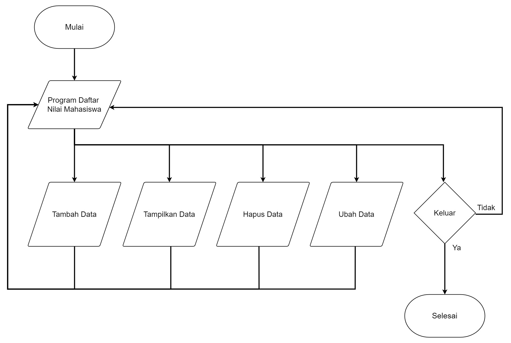

Berikut adalah code saya

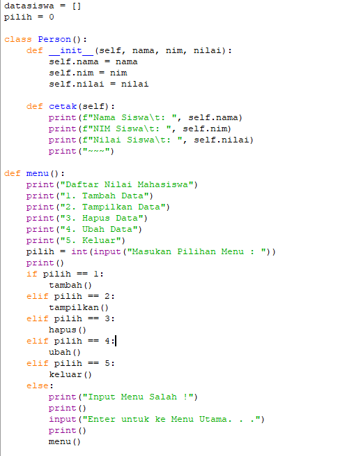

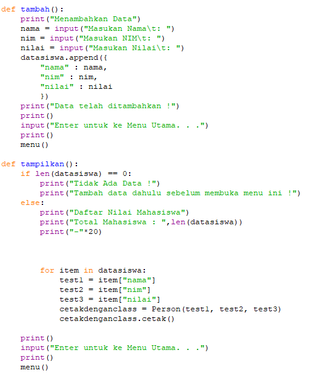

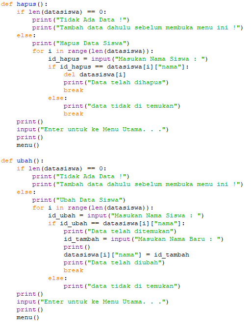

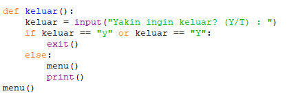

Tampilan dari fungsi menu().\
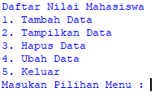

Tampilan dari fungsi tambah().\
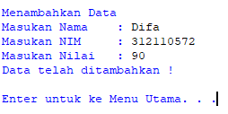
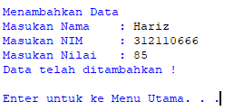

Tampilan dari fungsi tampilkan().\
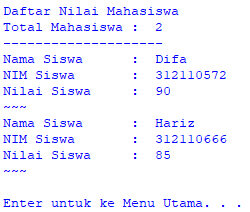

Tampilan dari fungsi hapus().\
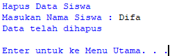

Tampilan dari fungsi ubah().\
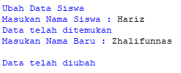
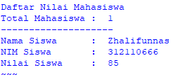